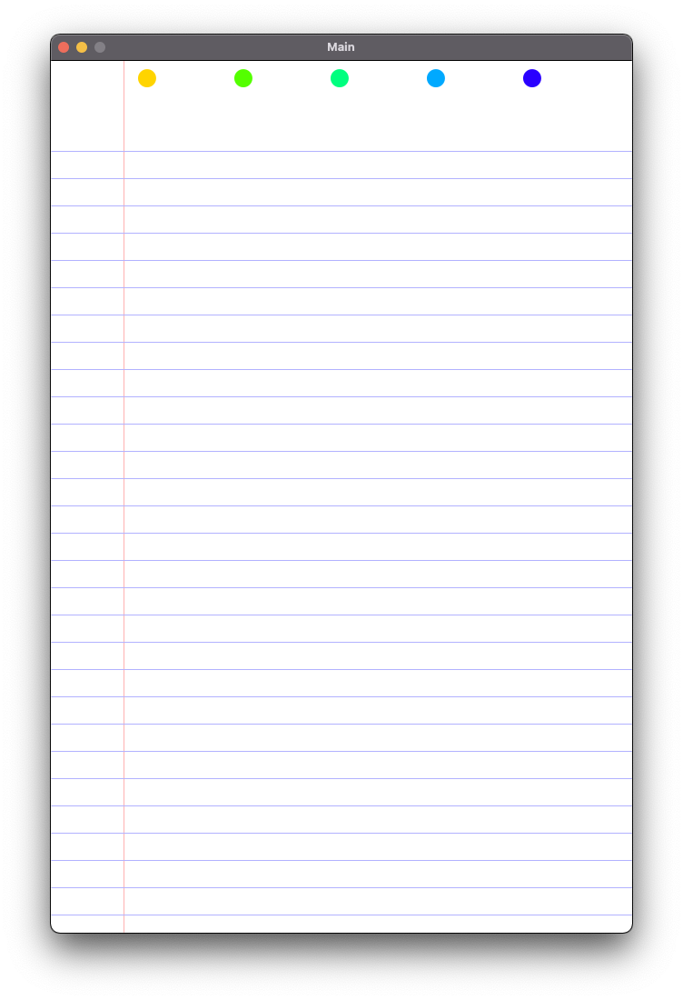
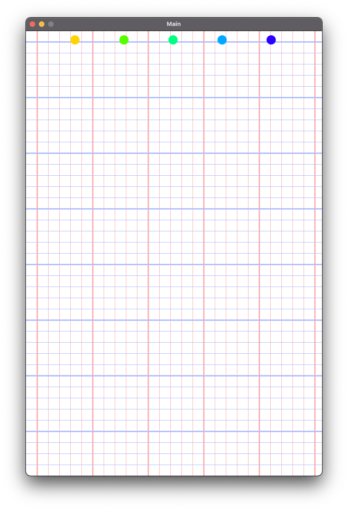
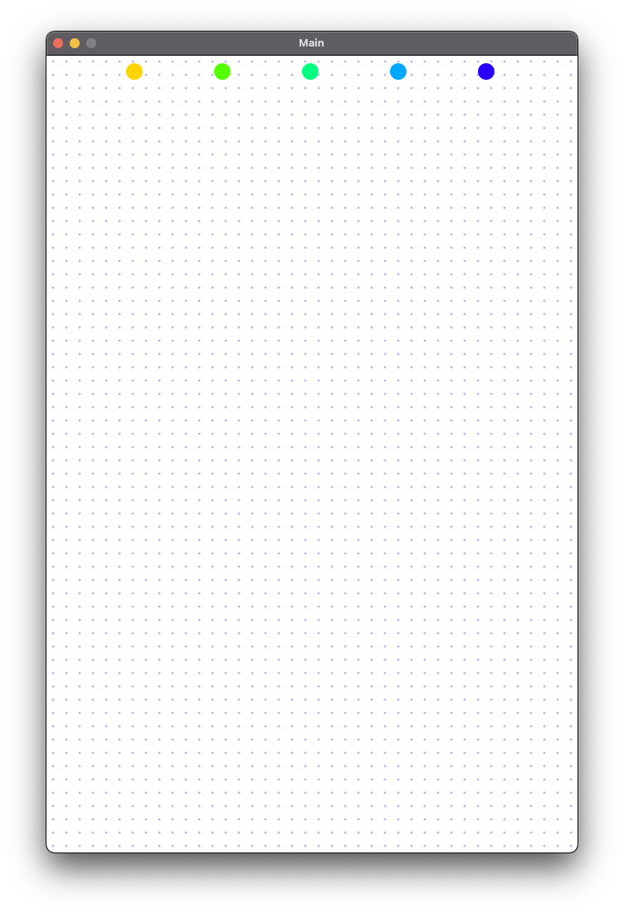

# Visualized Loops
This project will focus on using loops to draw various forms of paper styles. The goal is to practice both while loops and for loops and to quickly visualize the results to help you 'see' the iterations occuring.

# Provided Code
* This project's contents can be found in the Main class.
* An enum, PaperStyle, which identifies the various types of paper which can be drawn.
* Settings, setup, and draw: provide the basic structure of how colors will be defined and calls specific methods based on the current PaperStyle.
* Menu: Draws ellipses which can be used to change the current PaperStyle by hovering over the ellipses.

# Goals
You will be building the logic and code which belongs in the methods:
* drawLinedPaper - Draws paper looking like the traditional college ruled/wide ruled paper.
* drawGridPaper - Draws paper similar to mathematical graph paper.
* drawDotPaper - Draws an engineering style paper with a grid of dots.
* drawPrettyPaper - A fun paper filled with colors. Not a traditional paper.

# Processing Reminder
* line(0, 0, width, height) would draw a line from the top left corner of the screen to the bottom right corner.

# Concepts
* while loops
* for loops
* nested loops
* iterator values

# Instructions
**drawLinedPaper**
* Create one vertical line all the way from the top to the bottom of the screen. The line should be leftMargin away from the left side of the screen. Use the stroke color of (0, 30, 100).
* Create horizontal lines all the way from the top margin value to the bottom of the screen. Each horizontal line should be separated by the gapHeight amount. Use the stroke color of (240, 30, 100).
* This method can be finished with either for loops or while loops. For practice, try using a while loop.

**drawGridPaper**
* Create both horizontal and vertical lines that cover the whole screen. Each line should be separated by the boxLength amount.
* Each vertical line should use stroke (230, 30, 100). Horizontal lines should use stroke(0, 30, 100).
* If isEngineer is true, then each 5th line (both horizontal and vertical) should be thicker. Use the strokeWeight(#) method to create thicker lines for these. Values of 3 for thick lines and 1 for regular lines work well.

* **drawDotPaper**
* Create dots (ellipses) with the given radius.
* How will you create a dot in such a way that each different x coordinate will have a dot along different y coordinates?

* **drawPrettyPaper**
* For fun! But also practice.
* Colors can be calculated into integers with: color( <hue>, <saturation>, <brightness> );  Example: int chosenColor = color(200, 100, 100);
* A single pixel can be set in processing by using the method:  set(<x coordinate>, <y coordinate> <color integer>); Example: set(400, 200, chosenColor);
* Set every pixel on the screen to a new color. When creating your color for a single pixel, use the x value of the pixel to generate the hue and use the y value of the pixel to generate the saturation. Leave the brightness at 100. To generate your hue, divide the x by the width of the screen to see the ratio of x to width, then multiply that ratio by the total number of hues (360). Similar with the saturation, but think about what changes would need to be made.

